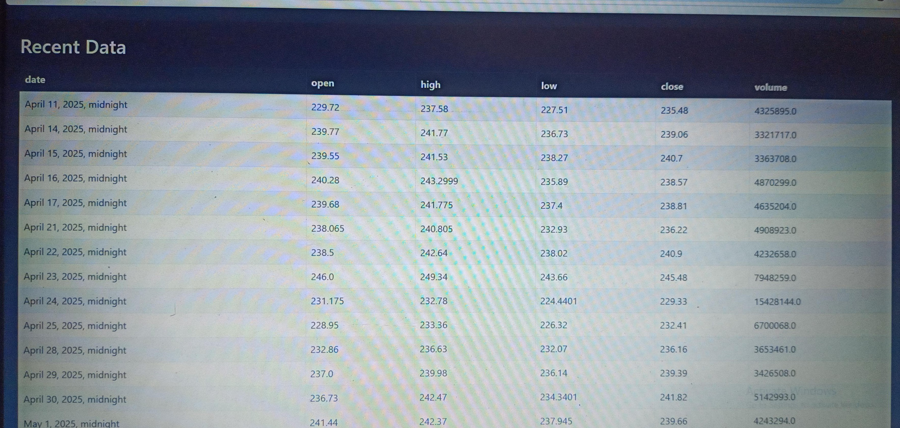

# 📈 Stock Market Forecasting using ARIMA, Prophet, and LSTM

## 1. Introduction :

This project aims to forecast stock market prices using three different time series models: ARIMA, Prophet, and LSTM. These models were selected for their ability to capture linear trends, seasonality, and complex temporal dependencies.

## 2. Data Overview :

The dataset includes historical stock prices retrieved using Alpha Vantage. The focus is on forecasting the stock prices of IBM. Below is a snapshot of recent data:

## 📊 Recent Stock Data Preview

### Recent Data (Part 1)


### Recent Data (Part 2)


## 3. Model Implementations :

**3.1 ARIMA Model Forecasting :**

The ARIMA model was implemented with parameters (p,d,q) optimized using AIC/BIC values and residual analysis. It captures linear dependencies and trend.

## 📊 ARIMA Forecast Result


**Observation :**
The ARIMA model provides a relatively smooth forecast and closely follows the historical trend, especially for short-term predictions.

**3.2 Prophet Model Forecasting** :

Prophet, developed by Facebook, was chosen for its flexibility in modeling daily/weekly seasonality and holiday effects.

## 📊 PROPHET Forecast Result


**Observation :**
Prophet captures seasonal patterns effectively and adapts well to trend shifts. However, it may slightly underperform during highly volatile market phases.

**3.3 LSTM Forecasting Using Deep Learning** :

An LSTM model was trained using sliding windows over the time series data. The model was tuned using dropout, learning rate schedules, and number of epochs.

## 📊 PROPHET Forecast Result


**Observation :**
The LSTM model shows promising performance with good predictive alignment, especially in capturing sharp fluctuations in stock price.

## 4. Forecast Results Comparison :

**Below is a comparison of performance metrics among all models** :

## 📊 Forecast Results :


## 📐 Model Performance Metrics :

| Model   | RMSE     | MAE      | R² Score |
|---------|----------|----------|----------|
| ARIMA   | 2.049    | -----    | 0.997    |
| Prophet | 46.26    | -----    | -16.1    |
| LSTM    | 3.707    | -----    | 0.991    |


## 5. Forecast vs Actual Analysis :

To assess each model’s practical utility, we compared forecasted values to actual values for a test period.

## 📊 Arima Forecast VS Actual


**Insight :**
ARIMA aligns closely for short intervals, while LSTM handles rapid variations better.

## 6. Conclusion and Insights :

Best Short-Term Forecast: ARIMA due to stable trend modeling.

Best Long-Term Forecast: LSTM owing to its non-linear pattern learning.

Most Interpretable Model: Prophet due to its trend + seasonality decomposition.

## Future Work :

Include more external regressors (e.g., volume, news sentiment).

Integrate ensemble forecasting.

Automate retraining pipelines for live prediction.


## 📧 Contact :
**Author Name : Archana Pati**

**📧 patiarchana.ap@gmail.com**

**🔗 https://www.linkedin.com/in/archana-pati**

**👩‍💻 GitHub: @Archana98-bit**

For questions or collaboration, feel free to reach out!


## ⚖️ License :
This project is licensed under the MIT License.


## 📁 Project Structure :

```bash
├── data/
│   └── ibm_stock.csv
├── models/
│   ├── arima_model.py
│   ├── prophet_model.py
│   └── lstm_model.py
├── static/images/
│   └── [All uploaded image files]
├── notebooks/
│   └── analysis_notebook.ipynb
├── README.md
└── requirements.txt
